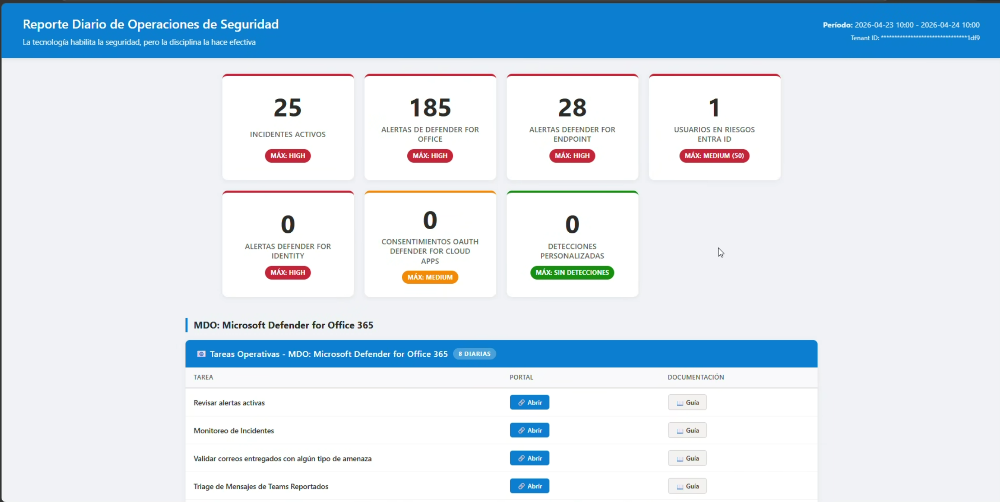

# Guía Operacional de Seguridad  Microsoft 365 Defender XDR

**Autores:** [Ernesto Cobos Roqueñí](https://www.linkedin.com/in/ernesto-cobos/) & [Arturo Mandujano](https://www.linkedin.com/in/jose-arturo-mandujano-avila-621b00b9/) 

Si tienes alguna duda o comentarios envianos un correo a <contactanos@zerotrustacademy.net>

> Marco de operaciones de seguridad (SecOps) para Microsoft Defender XDR con guías operativas, scripts de automatización, líneas base de configuración y paquetes de consultas KQL.

---

## Descripción del Proyecto

Este repositorio contiene el marco completo de operaciones de seguridad para organizaciones que utilizan **Microsoft 365 Defender XDR**. Proporciona:

- **Guías operativas** diarias, semanales y mensuales para cada pilar de Defender (MDO, MDE, MDI, MDA, Entra ID).
- **Scripts de automatización** en PowerShell para reportes ejecutivos, validación de configuraciones y creación de políticas de alerta.
- **Líneas base de seguridad** alineadas con las recomendaciones de Microsoft (Standard/Strict).
- **Paquetes de consultas KQL** para Advanced Hunting orientados a detección, triaje e investigación.
- **Reportes HTML automatizados** (diarios y semanales) que transforman telemetría técnica en información accionable para el CISO y el equipo de SecOps.

También puedes encontrar más información en nuestro [Canal de YouTube Zero Trust Academy](https://www.youtube.com/playlist?list=PLk1Nqr3GYcyQPLg77xneut3TaJ9ic0NdU)




### Valor de Negocio

| Audiencia | Beneficio |
|---|---|
| **CISO / Dirección** | KPIs claros de exposición y riesgo, visibilidad ejecutiva sin necesidad de acceder a consolas técnicas |
| **Equipo de SecOps** | Guías paso a paso para operaciones diarias, scripts automatizados para reducir trabajo manual |
| **Administradores de Infraestructura** | Validación de configuraciones contra líneas base recomendadas, reportes de higiene del tenant |

---

## Tabla de Contenidos

- [Requisitos y Dependencias](#requisitos-y-dependencias)
- [Microsoft Entra ID (Identidad)](#microsoft-entra-id-identidad)
- [Microsoft Defender for Office 365 (MDO)](#microsoft-defender-for-office-365-mdo)
- [Microsoft Defender for Endpoint (MDE)](#microsoft-defender-for-endpoint-mde)
- [Microsoft Defender for Identity (MDI)](#microsoft-defender-for-identity-mdi)
- [Microsoft Defender for Cloud Apps (MDA)](#microsoft-defender-for-cloud-apps-mda)
- [Microsoft Defender XDR (Reportes Cross-Domain)](#microsoft-defender-xdr-reportes-cross-domain)
- [Respuesta a Incidentes (IR)](#respuesta-a-incidentes-ir)
- [Microsoft Sentinel](#microsoft-sentinel)
- [Estructura del Repositorio](#estructura-del-repositorio)
- [Convenciones del Repositorio](#convenciones-del-repositorio)

---

## Requisitos y Dependencias

Consulte [Requisitos.md](Requisitos.md) para la guía completa de:

- Licenciamiento Microsoft 365 (E5 o licencias independientes de Defender)
- Entorno de ejecución (PowerShell 5.1+, módulos necesarios)
- Registro de aplicación en Entra ID (App Registration, permisos de API, modos de autenticación)
- Configuración de credenciales y Task Scheduler para automatización

---

## Microsoft Entra ID (Identidad)

Guías operativas y herramientas para la gestión de seguridad de identidades.

### Guías Operativas

| Cadencia | Documento |
|---|---|
| Diaria | [Guía Operativa EntraID - Diaria](EntraID/Guia%20Operativa%20EntraID%20-%20Diaria.md) |
| Semanal | [Guía Operativa EntraID - Semanal](EntraID/Guia%20Operativa%20EntraID%20-%20Semanal.md) |
| Mensual / Ad-hoc | [Guía Operativa EntraID - Mensual/Ad-Hoc](EntraID/Guia%20Operativa%20EntraID%20-%20Mensual%20Ad-Hoc.md) |

### Líneas Base

| Documento | Descripción |
|---|---|
| [Línea base Conditional Access Policies](EntraID/Politicas/Politica%20de%20Acceso%20Condicional.md) | Plantillas de políticas de Conditional Access (MFA para todos los usuarios, exclusiones break-glass, Report-only) |

### Consultas KQL

| Documento | Descripción |
|---|---|
| [Paquete KQL EntraID - Advanced Hunting](EntraID/Paquete%20KQL%20EntraID%20-%20Advanced%20Hunting.md) | Consultas de Advanced Hunting enfocadas en detección e investigación de amenazas de identidad |

### Scripts

| Script | Descripción |
|---|---|
| [Get-ConditionalAccessPolicies.ps1](EntraID/Scripts/Get-ConditionalAccessPolicies.ps1) | Exporta reporte detallado de todas las Conditional Access Policies (consola + CSV + HTML) |
| [Get-InactiveUsers.ps1](EntraID/Scripts/Get-InactiveUsers.ps1) | Lista usuarios sin actividad de inicio de sesión en los últimos N días vía Microsoft Graph |
| [Get-M365RoleReport.ps1](EntraID/Scripts/Get-M365RoleReport.ps1) | Enumera miembros de roles administrativos en Entra ID, Security & Compliance y Exchange Online |

---

## Microsoft Defender for Office 365 (MDO)

Guías, líneas base, políticas y scripts para la seguridad del correo electrónico y colaboración.

### Guías Operativas

| Cadencia | Documento |
|---|---|
| Diaria | [Guía de Seguridad Operacional MDO Diaria](MDO/Guia%20Operativa%20MDO%20-%20Diaria.md) |
| Semanal | [Guía de Seguridad Operacional MDO Semanal](MDO/Guia%20Operativa%20MDO%20-%20Semanal.md) |
| Mensual / Ad-hoc | [Guía de Seguridad Operacional MDO Mensual Ad-Hoc](MDO/Guia%20Operativa%20MDO%20-%20Mensual%20Ad-Hoc.md) |

### Líneas Base

| Documento | Descripción |
|---|---|
| [Protección contra BEC](MDO/Linea%20Base/Linea%20base%20de%20proteccion%20contra%20BEC.md) | Estrategia de defensa en capas contra suplantación de identidad y compromiso de correo empresarial |
| [Postura de seguridad Exchange Online](MDO/Linea%20Base/Linea%20base%20de%20seguridad%20en%20Exchange%20Online.md) | Configuración de seguridad del flujo de correo bajo Zero Trust (SPF, DKIM, DMARC, MTA-STS) |

### Políticas

| Documento | Descripción |
|---|---|
| [Política Anti-Phishing](MDO/Politicas/Politica%20Anti-Phishing.md) | Guía paso a paso para crear política Anti-Phishing con protección BEC para ejecutivos |
| [Política de Safe Attachments](MDO/Politicas/Politica%20de%20Safe%20Attachments.md) | Guía para crear política de Safe Attachments (detonación en sandbox) |
| [Política de Safe Links](MDO/Politicas/Politica%20de%20Safe%20Links.md) | Guía para crear política de Safe Links enfocada en protección BEC de URLs |

### Consultas KQL

| Documento | Descripción |
|---|---|
| [Paquete MDO KQL Advanced Hunting](MDO/Paquete%20KQL%20MDO%20-%20Advanced%20Hunting.md) | Consultas de detección, triaje e investigación de amenazas de correo electrónico |

### Scripts

| Script | Descripción |
|---|---|
| [Validate-MDOPolicies.ps1](MDO/Scripts/Validate-MDOPolicies.ps1) | Valida todas las políticas MDO contra recomendaciones Microsoft Standard/Strict |
| [Validate-EXOSecurityBaseline.ps1](MDO/Scripts/Validate-EXOSecurityBaseline.ps1) | Valida la línea base de seguridad de Exchange Online (transport rules, SPF/DKIM/DMARC/MTA-STS) |
| [Validate-ZAPConfiguration.ps1](MDO/Scripts/Validate-ZAPConfiguration.ps1) | Valida configuración de Zero-hour Auto Purge (ZAP) y genera dashboard HTML |
| [Domain-Health-Check.ps1](MDO/Scripts/Domain-Health-Check.ps1) | Verifica registros DNS de autenticación (SPF, DKIM, DMARC, MTA-STS) y genera reporte HTML |
| [Attachmentscannotbeinspected.ps1](MDO/Scripts/Attachmentscannotbeinspected.ps1) | Crea transport rule para poner en cuarentena correos con adjuntos no inspeccionables |
| [Block-OnMicrosoftEmails.ps1](MDO/Scripts/Block-OnMicrosoftEmails.ps1) | Crea transport rule para bloquear correos enviados a direcciones `*.onmicrosoft.com` |

---

## Microsoft Defender for Endpoint (MDE)

Guías operativas y reportes de vulnerabilidades para la seguridad de endpoints.

### Guías Operativas

| Cadencia | Documento |
|---|---|
| Diaria | [Guía de Seguridad Operacional MDE Diaria](MDE/Guia%20Operativa%20MDE%20-%20Diaria.md) |
| Semanal | [Guía de Seguridad Operacional MDE Semanal](MDE/Guia%20Operativa%20MDE%20-%20Semanal.md) |

### Scripts

| Script | Descripción |
|---|---|
| [New-DefenderVulnerabilityReport.ps1](MDE/Scripts/New-DefenderVulnerabilityReport.ps1) | Genera reporte ejecutivo HTML de vulnerabilidades vía API de M365 Defender (CVEs, distribución de severidad, explotabilidad) |

---

## Microsoft Defender for Identity (MDI)

Guías operativas y consultas KQL para la protección de identidades on-premises y detección de movimiento lateral.

### Guías Operativas

| Cadencia | Documento |
|---|---|
| Diaria | [Guía Operativa MDI - Diaria](MDI/Guia%20Operativa%20MDI%20-%20Diaria.md) |
| Semanal | [Guía Operativa MDI - Semanal](MDI/Guia%20Operativa%20MDI%20-%20Semanal.md) |
| Mensual / Ad-hoc | [Guía Operativa MDI - Mensual/Ad-Hoc](MDI/Guia%20Operativa%20MDI%20-%20Mensual%20Ad-Hoc.md) |

### Consultas KQL

| Documento | Descripción |
|---|---|
| [Paquete MDI KQL Advanced Hunting](MDI/Paquete%20KQL%20MDI%20-%20Advanced%20Hunting.md) | Consultas de detección e investigación de amenazas de identidad para MDI |

---

## Microsoft Defender for Cloud Apps (MDA)

> Sección en desarrollo. Próximamente se incluirán guías operativas, líneas base y scripts para MDA.

---

## Microsoft Defender XDR (Reportes Cross-Domain)

Reportes automatizados que consolidan telemetría de MDO, MDE, MDI y MDA en reportes ejecutivos HTML.

### Scripts

| Script | Descripción | Instrucciones |
|---|---|---|
| [New-DefenderXDRDailyReport.ps1](XDR/New-DefenderXDRDailyReport.ps1) | Genera reporte diario HTML vía Advanced Hunting API |
| [New-DefenderXDRWeeklyReport.ps1](XDR/New-DefenderXDRWeeklyReport.ps1) | Genera reporte semanal ejecutivo HTML con KPIs y tendencias |
| [New-DefenderVulnerabilityReport.ps1](MDE/Scripts/New-DefenderVulnerabilityReport.ps1) | Genera reporte de vulnerabilidades (TVM) en HTML | [Instrucciones](MDE/Scripts/Instrucciones%20-%20New-DefenderVulnerabilityReport.md) |
| [Setup-DefenderXDRReportServer.ps1](XDR/Setup-DefenderXDRReportServer.ps1) | Setup inicial del servidor: estructura de carpetas, credenciales DPAPI/cert, Task Scheduler para automatización | — |

### Características de los Reportes

- **Grid de KPIs**: Métricas clave (Alertas MDE, Phishing, High Risk Users) en la parte superior
- **Secciones por dominio**: MDO (campañas y usuarios objetivo), MDE (severidad de alertas), MDI (fuerza bruta y riesgo), MDA (OAuth y cloud apps)
- **Diseño ejecutivo**: Interfaz basada en Segoe UI, coherente con el ecosistema Microsoft
- **Automatización**: Task Scheduler para ejecución diaria (7:00 AM) y semanal (lunes 7:30 AM)

---

## Respuesta a Incidentes (IR)

Marco de respuesta a incidentes basado en NIST SP 800-61, con los roles del CSIRT, la matriz RACI y los playbooks por tipo de compromiso.

| Recurso | Descripción |
|---|---|
| [Plan de Respuesta a Incidentes CSIRT](IR/Plan%20de%20Respuesta%20a%20Incidentes%20CSIRT.md) | Plan maestro: fases, roles, severidades, escalamiento y comunicación al CISO |
| [Paquete KQL IR - Advanced Hunting](IR/Paquete%20KQL%20IR%20-%20Advanced%20Hunting.md) | Consultas de apoyo durante la contención, erradicación y recuperación |
| [Playbook IR - Compromiso de Identidad](IR/Playbooks/Playbook%20IR%20-%20Compromiso%20de%20Identidad%20%28MDI%20%2B%20Entra%20ID%29.md) | Respuesta a cuentas comprometidas (MDI + Entra ID) |
| [Playbook IR - Phishing y BEC](IR/Playbooks/Playbook%20IR%20-%20Phishing%20y%20BEC%20%28MDO%29.md) | Respuesta a campañas de phishing y fraude de correo (MDO) |
| [Playbook IR - Ransomware y Endpoint](IR/Playbooks/Playbook%20IR%20-%20Ransomware%20y%20Endpoint%20%28MDE%29.md) | Respuesta a ransomware y compromiso de estaciones (MDE) |
| [Playbook IR - OAuth y Shadow IT](IR/Playbooks/Playbook%20IR%20-%20OAuth%20y%20Shadow%20IT%20%28MDA%29.md) | Respuesta a aplicaciones OAuth maliciosas y TI en la sombra (MDA) |

---

## Microsoft Sentinel

Pilar independiente con su propio punto de entrada. Reúne cuatro bloques que no comparten prerrequisitos entre sí.

| Recurso | Descripción |
|---|---|
| [Sentinel/README.md](Sentinel/README.md) | **Punto de entrada.** Enrutamiento por objetivo y descripción de los cuatro bloques |
| [Guía operativa de Sentinel](Sentinel/Guia%20Operativa/guia_operativa_microsoft_sentinel.md) | Operación del SIEM/SOAR: cadencias, salud de conectores, costos y ciclo de vida de contenido |
| [AI SOC](Sentinel/AI%20SOC/README.md) | Guía de 16 secciones sobre SOC asistido por IA, agentes y niveles de autonomía |
| [Documentación DHCP-DNS](Sentinel/Documentacion%20DHCP-DNS/README.md) | Paquete de detección para telemetría DHCP y DNS (funciones, hunting, reglas, notebooks) |

---

## Estructura del Repositorio

```
gol2026/
├── README.md                          ← Este archivo
├── Requisitos.md                      ← Requisitos, licenciamiento y configuración
│
├── EntraID/                           ← Microsoft Entra ID (Identidad)
│   ├── Guia Operativa EntraID - {Diaria, Semanal, Mensual Ad-Hoc}.md
│   ├── Paquete KQL EntraID - Advanced Hunting.md
│   ├── Linea Base/                    ← Break glass, menor privilegio, revisión de roles
│   ├── Politicas/                     ← Acceso Condicional
│   └── Scripts/                       ← 3 scripts (CA policies, usuarios inactivos, roles)
│
├── MDO/                               ← Microsoft Defender for Office 365
│   ├── Guia Operativa MDO - {Diaria, Semanal, Mensual Ad-Hoc}.md
│   ├── Paquete KQL MDO - Advanced Hunting.md
│   ├── Linea Base/                    ← BEC, Exchange Online, Priority Accounts, alertas
│   ├── Politicas/                     ← Anti-Phishing, Safe Attachments, Safe Links
│   └── Scripts/                       ← 6 scripts (validaciones, transport rules)
│
├── MDE/                               ← Microsoft Defender for Endpoint
│   ├── Guia Operativa MDE - {Diaria, Semanal, Mensual Ad-Hoc}.md
│   ├── Paquete KQL MDE - Advanced Hunting.md
│   └── Scripts/                       ← Reporte de vulnerabilidades + instrucciones
│
├── MDI/                               ← Microsoft Defender for Identity
│   ├── Guia Operativa MDI - {Diaria, Semanal, Mensual Ad-Hoc}.md
│   └── Paquete KQL MDI - Advanced Hunting.md
│
├── MDA/                               ← Microsoft Defender for Cloud Apps
│   ├── Guia Operativa MDA - {Diaria, Semanal, Mensual Ad-Hoc}.md
│   └── Paquete KQL MDA - Advanced Hunting.md
│
├── XDR/                               ← Reportes cross-domain
│   ├── Scripts de reportería (diario, semanal, setup del servidor)
│   └── Reportes generados (.html) e imágenes
│
├── IR/                                ← Respuesta a Incidentes (CSIRT)
│   ├── Plan de Respuesta a Incidentes CSIRT.md
│   ├── Paquete KQL IR - Advanced Hunting.md
│   └── Playbooks/                     ← 4 playbooks (identidad, OAuth, phishing, ransomware)
│
└── Sentinel/                          ← Microsoft Sentinel (ver Sentinel/README.md)
    ├── Guia Operativa/                ← Operación del SIEM/SOAR
    ├── AI SOC/                        ← Guía de SOC asistido por IA (16 secciones)
    ├── Documentacion DHCP-DNS/        ← Paquete de detección DHCP/DNS
    ├── Funciones/  Hunting/  Reglas de Analitica/  Notebooks/  Workbook/
    └── README.md
```

---

## Convenciones del Repositorio

Estas reglas mantienen el repositorio navegable y evitan enlaces rotos entre plataformas.

| Elemento | Convención | Ejemplo |
|---|---|---|
| Nombres de archivo y carpeta | **ASCII sin acentos ni eñes**, para que las URL de GitHub no necesiten codificarse (`Gu%C3%ADa`) | `Guia Operativa MDE - Semanal.md` |
| Contenido de los documentos | **Ortografía española completa**, con acentos | `# Guía de Seguridad Operacional Semanal: …` |
| Guías operativas | `Guia Operativa <PILAR> - <Cadencia>.md` con cadencia `Diaria`, `Semanal` o `Mensual Ad-Hoc` | `Guia Operativa MDO - Mensual Ad-Hoc.md` |
| Paquetes de consultas | `Paquete KQL <PILAR> - Advanced Hunting.md` (siempre `Advanced`, no `Advance`) | `Paquete KQL MDI - Advanced Hunting.md` |
| Título H1 | Debe describir la misma cadencia y producto que el nombre del archivo | `# Guía de Seguridad Operacional Diaria: Microsoft Defender for Identity 🛡️` |
| Subcarpetas por pilar | `Linea Base/`, `Politicas/`, `Scripts/`, `Playbooks/` | `MDO/Politicas/Politica de Safe Links.md` |
| Scripts de PowerShell | `Verbo-Sustantivo.ps1` usando un verbo aprobado (`Get-Verb`) | `Get-InactiveUsers.ps1` |
| Enlaces relativos | Codificar los espacios como `%20`; nunca enlazar rutas que no existan en el repositorio | `[…](MDO/Politicas/Politica%20Anti-Phishing.md)` |
| Mayúsculas en rutas | Respetar el uso exacto de mayúsculas: GitHub distingue mayúsculas y minúsculas | `Sentinel/Notebooks/`, no `Sentinel/notebooks/` |

> **Pendiente conocido:** 7 scripts de `MDO/`, `EntraID/` y `XDR/` todavía no siguen `Verbo-Sustantivo` con verbo aprobado (`Validate-*` debería ser `Test-*`, `Setup-*` debería ser `Install-*`, `Domain-Health-Check.ps1` debería ser `Test-DomainHealth.ps1` y `Attachmentscannotbeinspected.ps1` necesita un nombre nuevo). Renombrarlos rompe los comandos documentados, por lo que se trata como un cambio aparte.

---

## Tecnologías Utilizadas

| Tecnología | Uso |
|---|---|
| **PowerShell 7+** | Scripts de automatización, validación y reportería |
| **KQL (Kusto Query Language)** | Consultas de Advanced Hunting en Microsoft 365 Defender |
| **Microsoft Graph API** | Consultas de identidad, roles y métodos de autenticación |
| **Microsoft 365 Defender API** | Advanced Hunting, reportes de vulnerabilidades |
| **Exchange Online PowerShell** | Validación de políticas MDO y configuración de Exchange |
| **HTML5 / CSS3** | Reportes ejecutivos visuales |

---

## Inicio Rápido

```powershell
# 1. Instalar módulos necesarios
Install-Module ExchangeOnlineManagement -Scope CurrentUser
Install-Module Microsoft.Graph -Scope CurrentUser

# 2. Conectar a los servicios
Connect-ExchangeOnline
Connect-IPPSSession

# 3. Configurar variables de entorno para reportes XDR
$env:AZURE_TENANT_ID     = "<tu-tenant-id>"
$env:AZURE_CLIENT_ID     = "<tu-client-id>"
$env:AZURE_CLIENT_SECRET  = "<tu-client-secret>"

# 4. Generar un reporte diario
.\XDR\New-DefenderXDRDailyReport.ps1

# 5. Validar políticas MDO
.\MDO\Scripts\Validate-MDOPolicies.ps1
```

> Para la configuración completa incluyendo App Registration, certificados y Task Scheduler, consulte [Requisitos.md](Requisitos.md).


PowerShell / Graph API (Opcional): Para la automatización y generación del archivo.


## ⚙️ Configuración y Uso

### Opción 1: Configuración Automatizada (Recomendado para Servidores)

```powershell
# 1. Ejecutar script de setup
.\Setup-DefenderReportServer.ps1

# 2. Seguir el asistente de configuración
# - Ingresa Tenant ID y Client ID
# - Configura Client Secret (encriptado con DPAPI)
# - Valida permisos de API

# 3. Ejecutar reporte
.\Run-DefenderXDRWeeklyReport.ps1
```

### Opción 2: Configuración Manual

```powershell
# Clonar el repositorio
git clone https://github.com/watchdogcode/gol2026

# Crear SecureString para Client Secret
$Secret = Read-Host "Client Secret" -AsSecureString
$Secret | ConvertFrom-SecureString | Out-File "C:\Config\Secret.txt"

# Ejecutar reporte
$SecureSecret = Get-Content "C:\Config\Secret.txt" | ConvertTo-SecureString
.\New-DefenderXDRWeeklyReport.ps1 `
    -TenantId "your-tenant-id" `
    -ClientId "your-client-id" `
    -AuthMode Secret `
    -ClientSecret $SecureSecret `
    -UseParallel `
    -ExportCsv
```

### Requisitos Previos

- **Azure AD App Registration** con permisos:
  - `AdvancedHunting.Read.All` (Application)
  - Admin Consent otorgado
- **PowerShell 5.1** o superior (7+ recomendado para ejecución paralela)
- **Licencias requeridas**: Microsoft 365 E5 o Microsoft Defender XDR

## 🆕 Nuevas Características (v2.0)

### 🔒 Seguridad Mejorada
- ✅ **SecureString** para Client Secret (encriptación DPAPI local)
- ✅ **Enmascaramiento** de Tenant ID en reportes
- ✅ **Limpieza automática** de variables sensibles en memoria
- ✅ **Cache de tokens** con expiración automática

### ⚡ Rendimiento
- ✅ **Ejecución paralela** de queries (hasta 5x más rápido)
- ✅ **Cache de autenticación** (reutiliza tokens válidos)
- ✅ **Reintentos exponenciales** con backoff inteligente

### 📊 Funcionalidad
- ✅ **Exportación CSV** de todas las tablas
- ✅ **Comparación con período anterior** (KPI trends)
- ✅ **Logging estructurado** con niveles (INFO/WARN/ERROR/DEBUG)
- ✅ **Modo test** para pruebas sin API

### 🛡️ Robustez
- ✅ **Manejo de errores granular** (no falla todo por un query)
- ✅ **Validación de datos** antes de generar reporte
- ✅ **Timeout mejorado** en Device Code flow
- ✅ **Variables configurables** (retry limits, thresholds)

## 🔧 Ejemplos de Uso

### Ejecución Programada (Task Scheduler)
```powershell
# Crear tarea semanal (Lunes 7 AM)
$Action = New-ScheduledTaskAction -Execute 'PowerShell.exe' `
    -Argument '-NoProfile -ExecutionPolicy Bypass -File "C:\Scripts\Run-DefenderXDRWeeklyReport.ps1"'
$Trigger = New-ScheduledTaskTrigger -Weekly -DaysOfWeek Monday -At 7am
Register-ScheduledTask -TaskName "DefenderXDR-WeeklyReport" `
    -Action $Action -Trigger $Trigger
```

### Uso Avanzado
```powershell
# Con todas las características
.\New-DefenderXDRWeeklyReport.ps1 `
    -TenantId "xxx" `
    -ClientId "yyy" `
    -AuthMode Secret `
    -ClientSecret $SecureSecret `
    -TimeWindowDays 14 `
    -UseParallel `
    -ExportCsv `
    -SendMail `
    -SmtpServer "smtp.office365.com" `
    -To "soc-team@empresa.com" `
    -LogPath "D:\Logs\Defender.log"
```

## ⚠️ Disclaimer

Este reporte es una herramienta de visualización. Los datos mostrados dependen de la correcta configuración de las licencias y conectores de Microsoft Defender XDR en tu entorno.

**Creado por:** Ernesto Cobos Roqueñi y Jose Arturo Mandujano  
**Versión:** 2.1
**Última actualización:** Abril 2026
