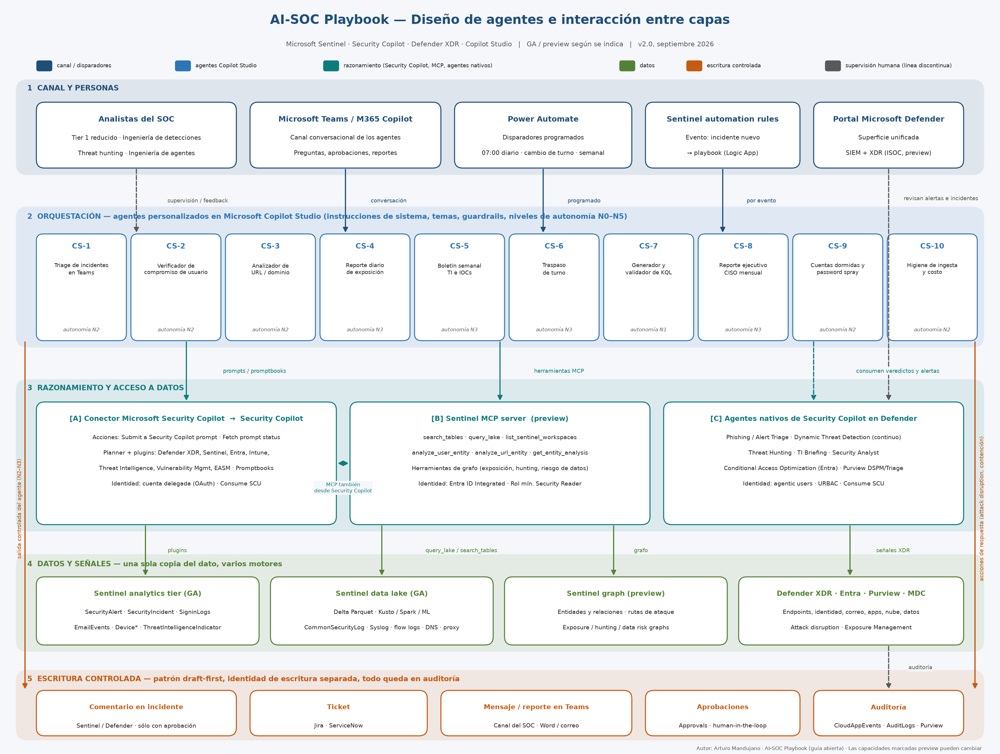
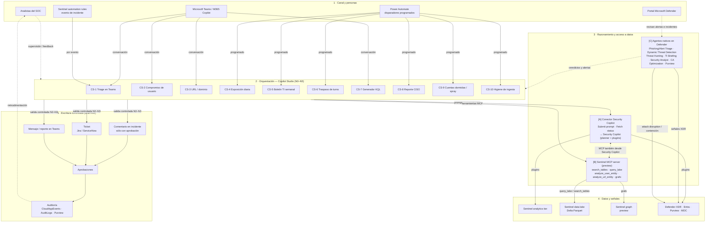

# Diseño de agentes e interacción entre capas

Este diagrama resume cómo se relacionan los agentes del AI-SOC: quién los dispara, dónde razonan, de qué datos se alimentan y por dónde escriben. Es la vista gráfica de la Figura 3 de la guía (sección 5.4) y de la tabla maestra de cadencias (sección 11.3).

## Lectura del diagrama

| Capa | Qué contiene | Identidad con la que opera |
|---|---|---|
| **1 · Canal y personas** | Analistas del SOC, Microsoft Teams / M365 Copilot (conversación), Power Automate (programado), Sentinel automation rules (por evento), portal Microsoft Defender | Usuario final autenticado |
| **2 · Orquestación** | Los 10 agentes de Copilot Studio (CS-1 a CS-10) con sus instrucciones de sistema, guardrails y nivel de autonomía N0–N5 | Entorno de Power Platform del SOC |
| **3 · Razonamiento y acceso a datos** | **[A]** Conector Microsoft Security Copilot (*Submit prompt* / *Fetch status*) → Security Copilot (planner + plugins). **[B]** Sentinel MCP server (preview): `search_tables`, `query_lake`, `analyze_user_entity`, `analyze_url_entity`, grafo. **[C]** Agentes nativos de Security Copilot en Defender | [A] cuenta delegada OAuth · [B] Entra ID Integrated, rol mínimo Security Reader · [C] agentic users con URBAC |
| **4 · Datos y señales** | Sentinel analytics tier, Sentinel data lake (Delta Parquet), Sentinel graph (preview), Defender XDR / Entra / Purview / Defender for Cloud | Roles del producto |
| **5 · Escritura controlada** | Comentario en incidente, ticket, mensaje en Teams, aprobaciones y auditoría; patrón *draft-first* con identidad de escritura separada | Identidad de escritura dedicada (p. ej. Microsoft Sentinel Responder) |

Las líneas discontinuas representan la supervisión humana: los analistas revisan veredictos, aprueban escrituras y retroalimentan a los agentes; ese ciclo es el que permite subir o bajar el nivel de autonomía (sección 11.7).

## Versión Mermaid (renderizada por GitHub)

## Interacciones clave entre agentes

1. **Dynamic Threat Detection Agent → Alert Triage Agent → CS-1.** El primero genera alertas con origen *Security Copilot*; el segundo las tría por evento; CS-1 permite al analista pedir en Teams el resumen del incidente resultante y, con aprobación, escribir el comentario.
2. **CS-2 y CS-3 apoyan a CS-1.** Cuando el incidente involucra un usuario o una URL, CS-1 puede delegar el veredicto a `analyze_user_entity` o `analyze_url_entity`, las mismas herramientas MCP que usan CS-2 y CS-3.
3. **Threat Intelligence Briefing Agent → CS-5.** El boletín semanal parte del briefing nativo y lo correlaciona contra `ThreatIntelligenceIndicator` con `query_lake`.
4. **CS-4, CS-10 → CS-8.** El reporte CISO mensual agrega la exposición diaria, la higiene de ingesta y los KPIs de las consultas 6.1.x y 6.2.x.
5. **CS-7 → reglas analíticas → todo lo anterior.** El generador de KQL alimenta la ingeniería de detecciones cuya cobertura mide la consulta 6.4.13.
6. **CS-6** consume el estado de los incidentes abiertos y los veredictos de los agentes anteriores para el traspaso de turno tres veces al día.
